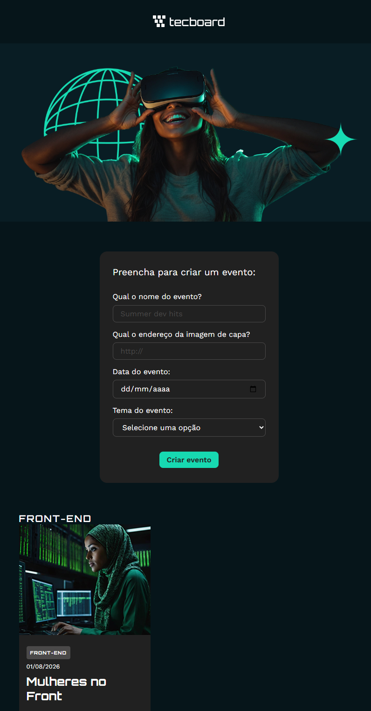

# 📌 TecBoard

Seu hub de eventos de tecnologia! Aplicação desenvolvida para cadastro, organização e filtragem de eventos por tema.

> 🎓 Projeto de estudos desenvolvido no curso **React 19: JSX, componentes, form action e useState** da **Alura**, ministrado pelo professor **Vinicios Neves**.

---

## 🛠️ Tecnologias Utilizadas

* React + Vite
* useState
* FormData
* CSS Modules
* Google Fonts (Work Sans + Orbitron)

---

## 🎯 Objetivos & Aprendizados

* **Programação Declarativa:** Entendimento da lógica do React baseada em estado
* **Componentização & Props:** Criação de componentes reutilizáveis e passagem de dados
* **Gerenciamento de Estado (`useState`):** Atualização dinâmica da interface
* **Formulários Interativos (`FormData`):** Captura e manipulação de dados
* **Renderização Condicional & Filtros:** Uso de `map`, `filter` e `some`

---
